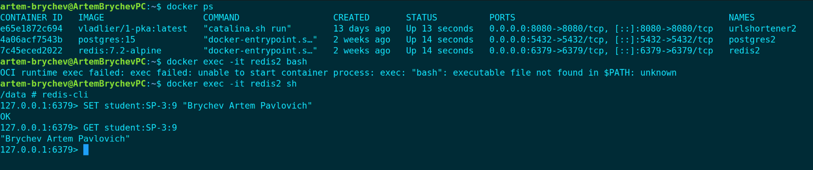
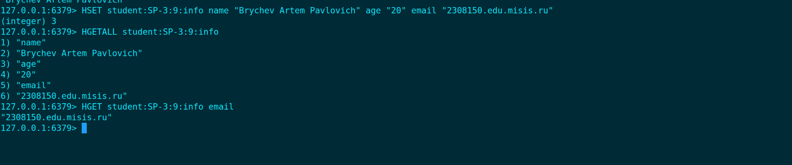
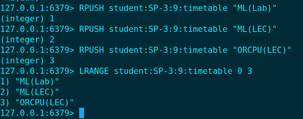
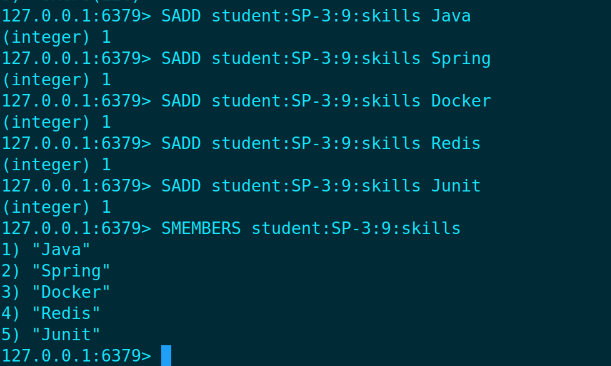
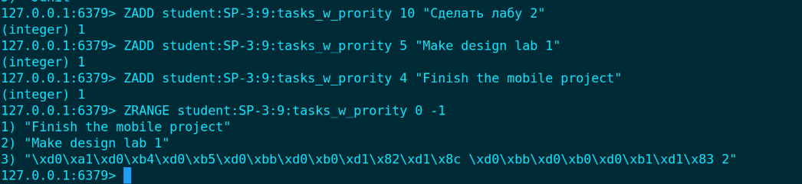
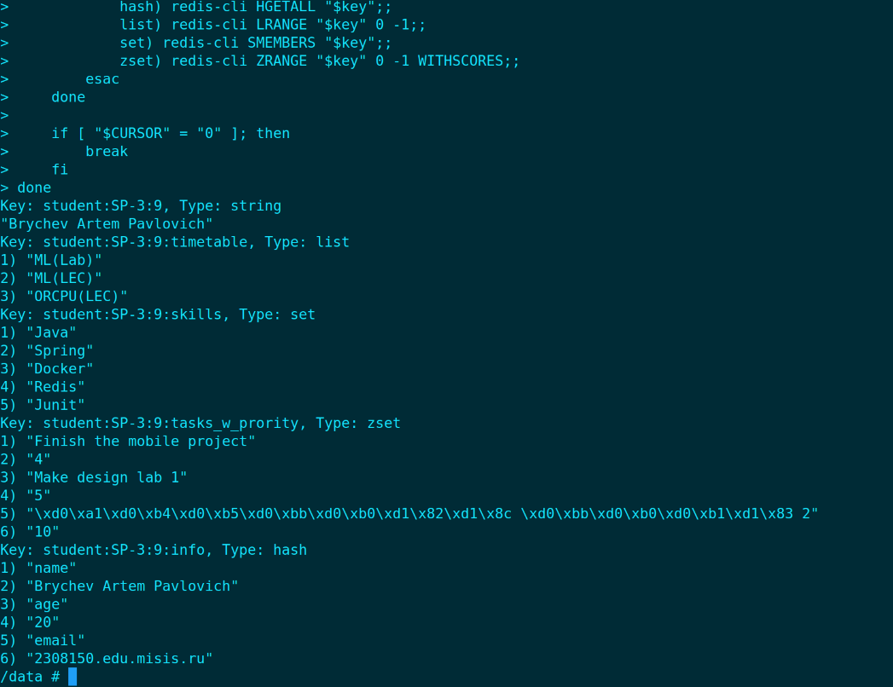

1. Первое задание String:

```artem-brychev@ArtemBrychevPC:~$ docker exec -it redis2 sh
/data # redis-cli
127.0.0.1:6379> SET student:SP-3:9 "Brychev Artem Pavlovich"
OK
127.0.0.1:6379> GET student:SP-3:9
"Brychev Artem Pavlovich"
127.0.0.1:6379>
```


2. Хеш таблица


```127.0.0.1:6379> HSET student:SP-3:9:info name "Brychev Artem Pavlovich" age "20" email "2308150.edu.misis.ru"
(integer) 3
127.0.0.1:6379> HGETALL student:SP-3:9:info
1) "name"
2) "Brychev Artem Pavlovich"
3) "age"
4) "20"
5) "email"
6) "2308150.edu.misis.ru"
127.0.0.1:6379> HGET student:SP-3:9:info email
"2308150.edu.misis.ru"
127.0.0.1:6379> 
```


3. Список


```
127.0.0.1:6379> RPUSH student:SP-3:9:timetable "ML(Lab)"
(integer) 1
127.0.0.1:6379> RPUSH student:SP-3:9:timetable "ML(LEC)"
(integer) 2
127.0.0.1:6379> RPUSH student:SP-3:9:timetable "ORCPU(LEC)"
(integer) 3
127.0.0.1:6379> LRANGE student:SP-3:9:timetable 0 3
1) "ML(Lab)"
2) "ML(LEC)"
3) "ORCPU(LEC)"
127.0.0.1:6379> 
```


4. Сет


```
127.0.0.1:6379> SADD student:SP-3:9:skills Java
(integer) 1
127.0.0.1:6379> SADD student:SP-3:9:skills Spring
(integer) 1
127.0.0.1:6379> SADD student:SP-3:9:skills Docker
(integer) 1
127.0.0.1:6379> SADD student:SP-3:9:skills Redis
(integer) 1
127.0.0.1:6379> SADD student:SP-3:9:skills Junit
(integer) 1
127.0.0.1:6379> SMEMBERS student:SP-3:9:skills
1) "Java"
2) "Spring"
3) "Docker"
4) "Redis"
5) "Junit"
127.0.0.1:6379>
```

5. zset


```
127.0.0.1:6379> ZADD student:SP-3:9:tasks_w_prority 10 "Сделать лабу 2"
(integer) 1
127.0.0.1:6379> ZADD student:SP-3:9:tasks_w_prority 5 "Make design lab 1"
(integer) 1
127.0.0.1:6379> ZADD student:SP-3:9:tasks_w_prority 4 "Finish the mobile project"
(integer) 1
127.0.0.1:6379> ZRANGE student:SP-3:9:tasks_w_prority 0 -1
1) "Finish the mobile project"
2) "Make design lab 1"
3) "\xd0\xa1\xd0\xb4\xd0\xb5\xd0\xbb\xd0\xb0\xd1\x82\xd1\x8c \xd0\xbb\xd0\xb0\xd0\xb1\xd1\x83 2"
127.0.0.1:6379> 
```


```
/data # CURSOR=0
/data # while true; do
>     result=$(redis-cli SCAN $CURSOR)
>     CURSOR=$(echo $result | awk '{print $1}')
>     KEYS=$(echo $result | cut -d' ' -f2-)
> 
>     for key in $KEYS; do
>         type=$(redis-cli TYPE "$key")
>         echo "Key: $key, Type: $type"
> 
>         case "$type" in
>             string) redis-cli GET "$key";;
>             hash) redis-cli HGETALL "$key";;
>             list) redis-cli LRANGE "$key" 0 -1;;
>             set) redis-cli SMEMBERS "$key";;
>             zset) redis-cli ZRANGE "$key" 0 -1 WITHSCORES;;
>         esac
>     done
> 
>     if [ "$CURSOR" = "0" ]; then
>         break
>     fi
> done
Key: student:SP-3:9, Type: string
"Brychev Artem Pavlovich"
Key: student:SP-3:9:timetable, Type: list
1) "ML(Lab)"
2) "ML(LEC)"
3) "ORCPU(LEC)"
Key: student:SP-3:9:skills, Type: set
4) "Java"
5) "Spring"
6) "Docker"
7) "Redis"
8) "Junit"
Key: student:SP-3:9:tasks_w_prority, Type: zset
9) "Finish the mobile project"
10) "4"
11) "Make design lab 1"
12) "5"
13) "\xd0\xa1\xd0\xb4\xd0\xb5\xd0\xbb\xd0\xb0\xd1\x82\xd1\x8c \xd0\xbb\xd0\xb0\xd0\xb1\xd1\x83 2"
14) "10"
Key: student:SP-3:9:info, Type: hash
15) "name"
16) "Brychev Artem Pavlovich"
17) "age"
18) "20"
19) "email"
20) "2308150.edu.misis.ru"
/data # 

```


