## Иметь поднятые Prometheus + Grafana + Alertmanager, например через docker-compose;
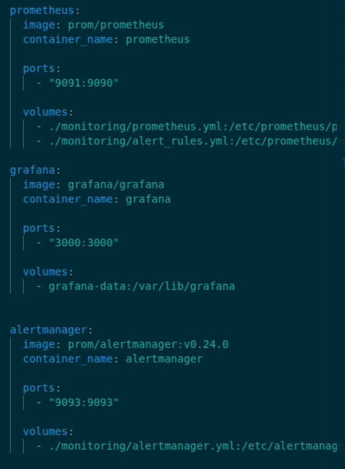

## Настроить Prometheus на сбор метрик для вашего приложения:
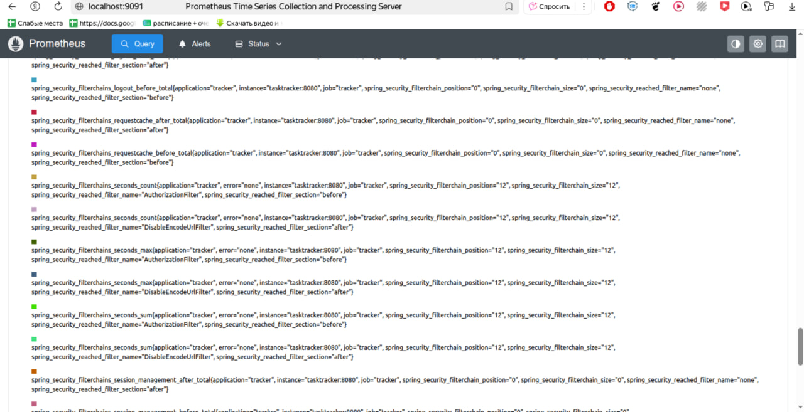
### Ваше приложение должно отдавать как минимум одну кастомную метрику типа Counter;
### Ваше приложение должно отдавать как минимум одну кастомную метрику любого другого типа;
### Как минимум для одной из метрик должны быть представлены лейблы, объявленные вами (значений не меньше двух).
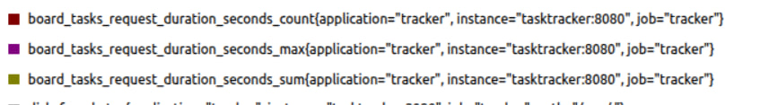
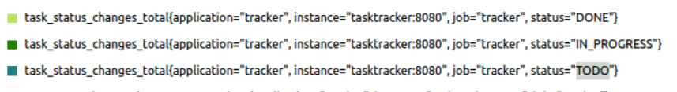

## В Grafana должно быть настроено не менее 3 дашбордов.
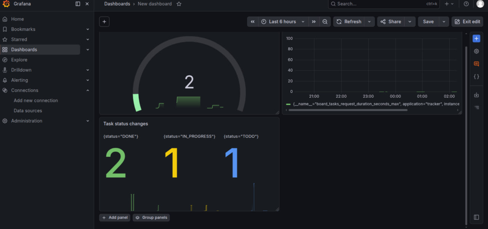
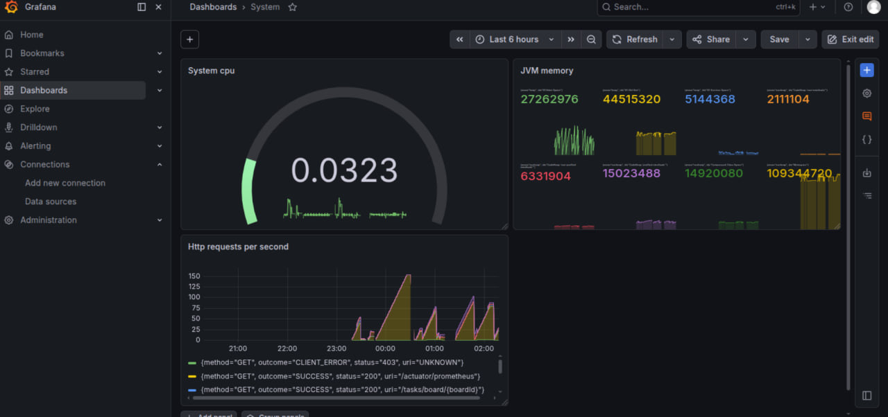
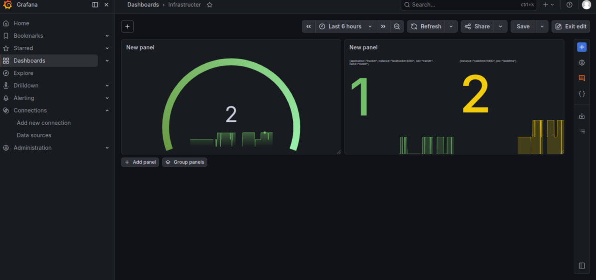

## Должен быть сделан сбор метрик с хотя бы одной внешней системы, к которой подключается ваше приложение (Postgres, Redis, RabbitMQ, любое другое).
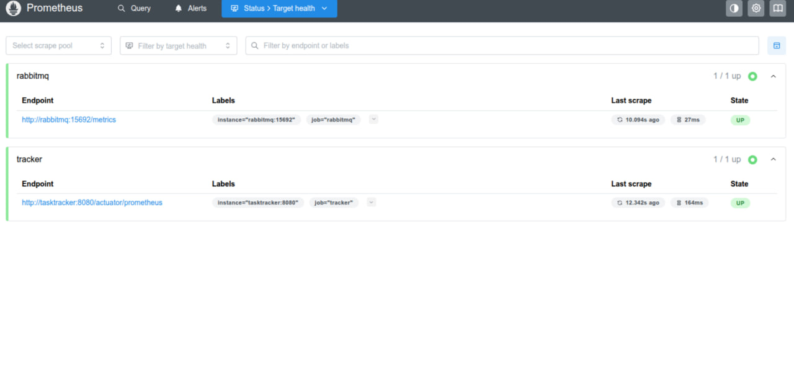

## Должно быть настроено как минимум три различных алерта.
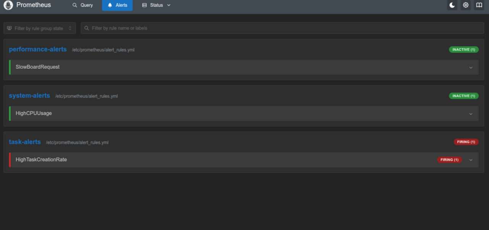

## Должен быть подключен Alertmanager и настроен на раздачу алертов (через SMTP/Telegram/что угодно еще).
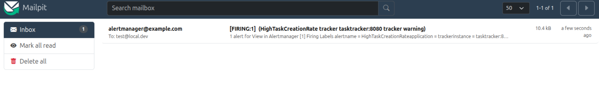
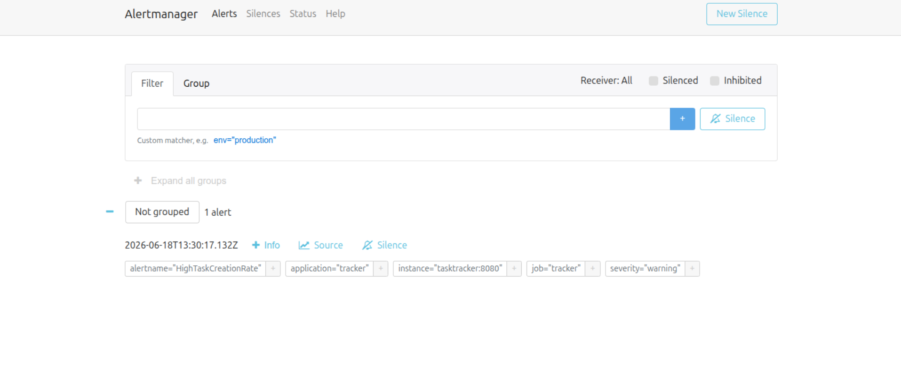